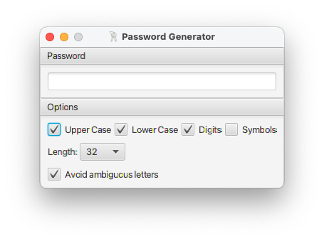

# Password Generator

Simple password generator for desktop platforms like OS X, Linux or Windows.



## Presets

There are two presets called by the corresponding button:

* UNIX - 8 letters and digits
* PIN - 4 digits

## Ambiguous Letters

This options excludes characters that may look confusing depending on font: 'I', 'l', 'O', '0'.

## Build and Run

### Build

Make sure Maven toolchain configuration ```toolchain.xml``` contains the following
definition:
```xml
<toolchain>
    <type>jdk</type>
    <provides>
        <version>13</version>
    </provides>
    <configuration>
        <jdkHome>/path/to/jdk-13</jdkHome>
    </configuration>
</toolchain>
```
Execute the following:
```shell script
$ mvn clean package
```

Application JAR and all dependencies will be placed in ```target/jmods```.

### Run

JDK-13 is required to run the application.


```
java --module-path target/jmods -Dfile.encoding=UTF-8 \
        -m password.generator/org.panteleyev.passwdgen.PasswordGeneratorApplication
```

### Binary Packages

To build binary installers perform the following steps:
* Install [JDK-14 EA](https://jdk.java.net/14/) build
* Set ```JPACKAGE_HOME``` environment variable to the root directory of JDK-14
* On Microsoft Windows: install [WiX Toolset](https://wixtoolset.org/releases/), add its binary directory to ```PATH``` 
environment variable
* Execute the following commands:
```shell script
$ mvn clean package
$ ./extras/osx-app.sh
  or
$ ./extras/win-app.sh
```

Installation packages will be found in ```target/dist``` directory.

## Support

There is no support for this application.